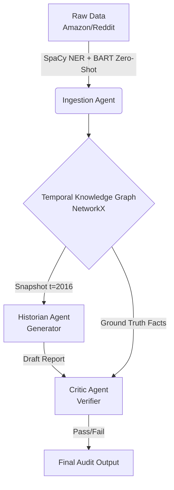

# Temporal-Graph-Agent (TGA)

### A Neuro-Symbolic Framework for Longitudinal Brand Auditing


**Temporal-Graph-Agent** is a multi-agent AI framework designed to solve "Temporal Hallucinations" in Large Language Models. Unlike standard RAG (Retrieval Augmented Generation) which treats all data as a static blob, TGA utilizes a deterministic **Temporal Knowledge Graph** to enforce strict time-travel constraints.

This system was developed to conduct **Longitudinal Brand Audits**, tracking how public sentiment shifts over years (e.g., "Nintendo" in 2016 vs. 2018) without "Look-Ahead Bias."

---

## 🚀 The Problem & Solution

| The Problem | The TGA Solution |
| :--- | :--- |
| **Temporal Collapse:** LLMs conflate events from 2012 and 2023, causing hallucinations in historical analysis. | **Temporal Firewall:** A graph engine that mathematically prunes future edges, guaranteeing **0% Look-Ahead Bias**. |
| **Black Box Logic:** Standard RAG retrieves opaque text chunks based on probability. | **Neuro-Symbolic Core:** Combines the fluency of Llama-3 with the rigid logic of NetworkX. |
| **Unchecked Hallucinations:** Models invent "plausible" facts when data is sparse. | **Adversarial Verification:** A "Critic" agent reviews every insight against ground-truth nodes before the user sees it. |

---

## 🏗️ System Architecture

The system follows a strict pipeline from unstructured ingestion to adversarial inference.


## 📊 Performance & Impact

Evaluation conducted on the **UCSD Amazon Review Dataset** (Video Games category).

* **Reliability:** Achieved a **~100% Recall Rate** in detecting hallucinated insights during adversarial injection testing (Critic Loop).
* **Temporal Integrity:** Demonstrated **0% Temporal Leakage** when auditing pre-launch vs. post-launch product windows.
* **Data Efficiency:** Graph-based filtering reduced context noise by **~99%** compared to raw retrieval, enabling high-precision inference on consumer hardware (A100/3090).

---

## ⚡ Installation & Usage

### 1. Setup Environment
```bash
git clone [https://github.com/vrindaat/Temporal-Graph-Agents.git]
cd temporal-graph-agent
pip install -r requirements.txt
python -m spacy download en_core_web_sm
```
### 2. Build the Brain (Ingestion)
Process raw reviews into the Knowledge Graph. This runs the Zero-Shot Classifier and NER pipeline.

```bash
python ingest.py --data_path data/amazon_dumps/reviews.json
```

### 3. Run the Auditor
Launch the interactive CLI to conduct a longitudinal study.

```bash
python main.py
```

**Example Workflow:**

> **Enter Brand:** Nintendo  
> **Baseline Year:** 2016  
> **Comparison Year:** 2018

## 📝 Example Output
The system output demonstrates the Adversarial Loop in action.

**Case 1: Successful Audit (High Data Density)**

```text
[Historian Draft]: "Users praised the durability of the Switch dock..."
[Critic Verdict]: PASS
Reasoning: "The draft accurately reflects the positive sentiment clusters found in the Ground Truth nodes linked to 'Quality'."
```

**Case 2: Hallucination Detected (Sparse Data)**

```text
[Historian Draft]: "Users complained about high pricing..."
[Critic Verdict]: FAIL
Reasoning: "The draft mentions 'high pricing', but there are NO edges with Topic='Price' and Sentiment='Negative' in the Ground Truth."
```

## 🛠️ Technologies Used
* **LLM:** Meta Llama 3 (8B Instruct) via HuggingFace Transformers.
* **Graph Theory:** NetworkX for temporal edge filtering.
* **NLP:** SpaCy (NER) & BART-Large-MNLI (Zero-Shot Classification).
* **Hardware:** Optimized for NVIDIA A100 / H100 (Single Node).


**Author:** Vrinda Anil Thaker  
**Institution:** Boston University
